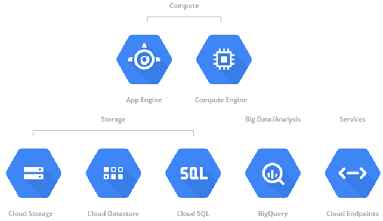
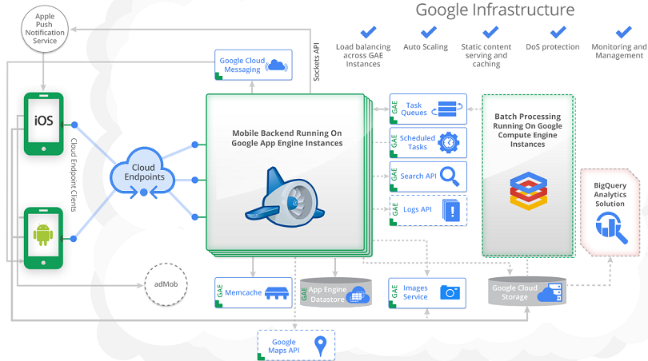

title: Course Info

<https://github.com/d3slect/Cloud-Application-Development/>

#Schedule

- **Lab 1** Intro, SDK, Hello World
- **Lab 2** Selection of services - APIs and internals
- **Lab 3** Advanced concepts (scaling up, high-availability)
<!-- - **Lab 4** Homework -->
<!--	- preferably Python (easier to use) -->
<!--	- individually or in small groups -->
<!--- **Lab 5** Homework cont. -->

#Requirements

- Google Account
- Python (basics of OOP, copy/paste) 

---

title: Introduction
subtitle: What is (isn't) Google App Engine
class: segue dark nobackground

---

title: What is Cloud Computing (at Google)?
content_class: smaller

<https://developers.google.com/cloud/>

- [GCP Live 2014](https://cloud.google.com/events/google-cloud-platform-live/stream)
 *"What is Cloud Computing?"* at [Google Training Tutorial](http://web.archive.org/web/20140706143751/https://developers.google.com/appengine/training/intro/whatiscc)

---

title: What is Google App Engine?
content_class: smaller

<https://developers.google.com/appengine/>

- Platform for development of scalable cloud-based web/mobile backends
	- Motto: *Scalability in the box*
	- Based on HTTP request handling
- PaaS - SDK for Python / Java / Go / PHP 
	- Runs on Google infrastructure
- Integrated with Google services
	- Management console and Google Accounts authentication
	- Other GCP Products (Compute Engine, Big Query, Endpoints, ...)
	- Google Apps (own domain name, ...), Youtube, ...
- Free quota 
<!-- - Further reading -->
<!--	- *Google App Engine Documentation* at [Google Training Tutorial](https://cloud.google.com/appengine) -->

---

title: What can App Engine do?
content_class: smaller

- Handle HTTP requests ([doc](https://developers.google.com/appengine/docs/python/runtime#Requests))
- Store data
	- Focus on non-relational (entity-based) store ([Datastore](https://developers.google.com/appengine/docs/python/datastore/overview))
	- Relational store ([Google Cloud SQL](https://developers.google.com/cloud-sql/))
	- Blob/raw store ([BlobStore](https://developers.google.com/appengine/docs/python/blobstore/overview), [Google Cloud Storage](https://developers.google.com/appengine/docs/python/googlecloudstorageclient/)) 
- Process data asynchronously on background ([Tasks](https://developers.google.com/appengine/docs/python/taskqueue/), [Modules](https://developers.google.com/appengine/docs/python/modules/))
- Cache data for quick access ([Memcache](https://developers.google.com/appengine/docs/python/memcache/), [NDB](https://developers.google.com/appengine/docs/python/ndb/))
- Analyze data ([MapReduce](https://developers.google.com/appengine/docs/python/dataprocessing/), [BigQuery](https://developers.google.com/bigquery/articles/datastoretobigquery))
- Interface with mobile/web clients ([Google Cloud Endpoints](https://developers.google.com/appengine/docs/python/endpoints/))
- Render HTML from templates ([Webapp2](https://developers.google.com/appengine/docs/python/tools/webapp2))
- Push data to clients ([Channel API](https://developers.google.com/appengine/docs/python/channel/))
- Download URL content ([Urlfetch API](https://developers.google.com/appengine/docs/python/urlfetch/))
- Send e-mails ([Mail API](https://developers.google.com/appengine/docs/python/mail/))
- and much more... ([doc](https://developers.google.com/appengine/docs/python/apis))

#It does everything in a way that scales!

---

title: (Example of) What App Engine can do
content_class: smaller

<https://cloud.google.com/developers/articles/mobile-application-solutions> 
<https://cloud.google.com/solutions/mobile/developing-mobile-games-on-google-app-engine-compute-engine/>

---

title: Quotas
content_class: smaller

- <https://developers.google.com/appengine/docs/quotas>
- Safety (daily, per minute), [billable](https://developers.google.com/appengine/docs/billing), fixed

<table>
  <tbody><tr>
    <th width="30%">Resource</th>
    <th>Free Default Daily Limit</th>
    <th>Billing Enabled Default Limit</th>
  </tr>
  <tr>
    <td>Blobstore Stored Data</td>
    <td>First 5 GB  <strong>Note:</strong> Not a daily limit but
a total limit.</td>
    <td>no maximum</td>
  </tr>
  <tr>
    <td>Code & Static Data Storage  (includes all versions)</td>
    <td>First 1 GB  <strong>Note:</strong> Not a daily limit but
a total limit.</td>
    <td>$0.026 per GB per month</td>
  </tr>
  <tr>
    <td>Stored Data  (billable)</td>
    <td>1 GB  <strong>Note:</strong> Not a daily limit but
a total limit.</td>
    <td>1 GB free; no maximum</td>
  </tr>
  <tr>
    <td>Number of Indexes</td>
    <td>200  <strong>Note:</strong> Not a daily limit but
a total limit.</td>
    <td>200</td>
  </tr>
  <tr>
    <td>Read/Write Operations</td>
    <td>50,000</td>
    <td>Unlimited</td>
  </tr>
  <tr>
    <td>Outgoing Bandwidth  (billable, includes HTTPS)</td>
    <td>1 GB 56 MB/minute</td>
    <td>1 GB free; 14,400 GB maximum 10 GB/minute</td>
  </tr>
  <tr>
    <td>Incoming Bandwidth (includes HTTPS)</td>
    <td>1 GB; 14,400 GB maximum 56 MB/minute</td>
    <td>None</td>
  </tr>

</tbody></table>

---

title: Hello World
subtitle: Following the Google's Tutorial
class: segue dark nobackground

---

title: Dev Tools
content_class: smaller

#SDK 

- [Doc](https://developers.google.com/appengine/docs/python/gettingstartedpython27/devenvironment), [Older tutorial](https://developers.google.com/appengine/training/intro/gettingstarted#install)
- Python 2.7 ([link](https://www.python.org/downloads/release/python-2711/)) 
- GAE Python SDK ([link](https://cloud.google.com/appengine/downloads#Google_App_Engine_SDK_for_Python))
- Make sure that the python and GAE SDK directories added to PATH ([link](http://docs.python.org/2/using/windows.html#setting-envvars)).

#File types you will encounter

- Python sources (`.py`)
- YAML configuration files (`.yaml`)
- Web sources (`.html`, `.css`, ...)

#Recommended tools

- Your favorite text editor (vim, ...)
- Jetbrains PyCharm ([link](https://www.jetbrains.com/pycharm/))
- IDLE: default Python editor ([link](http://docs.python.org/2/library/idle.html))
- Aptana Studio: Eclipse-based IDE ([link](http://www.aptana.com/))
- ...

---

title: Workflow
content_class: smaller

- Choose an application ID
- Implement the app 
	- Configuration files
	- Request handlers
	- ...
- Test it via the development server of the SDK
	- Automatically detects changes in the code
- Upload it to Google
- Monitor and manage the live app
- Download production data/logs
- Repeat

---

title: Hello World
content_class: smaller

- [Getting started guide at GAE docs](https://developers.google.com/appengine/docs/python/gettingstartedpython27/helloworld)
- [Getting started tutorial at Google Training](https://developers.google.com/appengine/training/intro/gettingstarted)

- Create a skeleton of a new Google Appengine app
	- Choose an ID, e.g., `helloworld`
	- Use the *Google App Engine Launcher* ([tutorial](https://developers.google.com/appengine/training/intro/gettingstarted#creating))
- You should get the following structure ([tutorial](https://developers.google.com/appengine/training/intro/gettingstarted#hello))
	- `app.yaml` - configuration of the app
	- `main.py` - implementation of the req. handler
	- complete sources also available at [github](https://github.com/d3slect/Cloud-Application-Development/tree/master/examples/helloworld)
- Test the app
	- Run the development server and visit <http://localhost:8080/>
	- Use the *Google App Engine Launcher* ([tutorial](https://developers.google.com/appengine/training/intro/gettingstarted#startdev)), or:

<pre class="prettyprint" data-lang="cmd">
python google_appengine/dev_appserver.py helloworld/
</pre>

---

title: App Configuration
content_class: smaller

The configuration of a GAE app is in the `app.yaml` file

<pre class="prettyprint" data-lang="YAML">
<b>application: helloworld
version: 1
runtime: python</b>27
api_version: 1
threadsafe: true

<b>handlers:
- url: /.*
  script: main.app</b>

libraries:
- name: webapp2
  version: latest
</pre>

- Further reading
	-  Application configuration [doc](https://developers.google.com/appengine/docs/python/config/appconfig)

---

title: Handling Requests
content_class: smaller

Request handler is a specific Python object in a specific module referred in the `app.yaml` file; e.g., `app` in `main.py`

<pre class="prettyprint" data-lang="python">
import webapp2

class MainHandler(webapp2.<b>RequestHandler</b>):
    def <b>get</b>(self):
        self.response.headers['Content-Type'] = 'text/plain'
        self.<b>response.write</b>('Hello world!')

app = webapp2.WSGIApplication([('/', MainHandler)], debug=True)
</pre>

- Further reading
	- webapp2 framework [doc](https://developers.google.com/appengine/docs/python/tools/webapp2)

---

title: Uploading the App to Google
content_class: smaller

*"Feed the Big Brother"*

- Create the app in the GAE Administration Console ([link](https://appengine.google.com/))
	- Choose the same ID you've selected before
- Upload the app ([tutorial](https://developers.google.com/appengine/docs/python/gettingstartedpython27/uploading), [doc](https://developers.google.com/appengine/docs/python/tools/uploadinganapp))
	- You need to fill in your Google Account information
	- You can upload different versions for the same app ID and select which one is used as the default ([doc](https://developers.google.com/appengine/docs/adminconsole/index))
	- Use the *Google App Engine Launcher* "Deploy" button ([tutorial](https://developers.google.com/appengine/training/intro/gettingstarted#upload)), or:
	
<pre class="prettyprint" data-lang="cmd">
python google_appengine/appcfg.py update helloworld/
</pre>

- Test the uploaded version
	- Default domain `http://your_app_id.appspot.com/`

---

title: Monitoring and Management 
content_class: smaller

- Development Console ([doc](https://developers.google.com/appengine/docs/python/tools/devserver#Python_The_Development_Console))
	- Runs on <http://localhost:8000/>
	- "SDK Console" button in the *Google App Engine Launcher*
	- Basic infromation about the app in the *development* environment
	- Service usage/state overview (Datastore Viewer, Task Queues)
	- Interactive Console 
- Administrator Console ([doc](https://developers.google.com/appengine/docs/adminconsole/?hl=en), [link](http://appengine.google.com))
	- All the 'possible' infromation about the app in the *production* environment
	- Service usage/state overview (again)
	- Resource usage, quotas (Main >> Quota Details)
	- Version management (Main >> Versions)
	- ...
- Try out and explore!

---

title: Guestbook app
subtitle: Following (again) the Google's Tutorial
class: segue dark nobackground

---

title: Guestbook App
content_class: smaller

[Tutorial](https://developers.google.com/appengine/docs/python/gettingstartedpython27/introduction)

- User authentication via Google Accounts
(
[tutorial](https://developers.google.com/appengine/docs/python/gettingstartedpython27/usingusers), 
[github](https://github.com/d3slect/Cloud-Application-Development/tree/master/examples/getting_started/step1_users)
)
- Handling HTTP requests (guestbook posts)
(
[tutorial](https://developers.google.com/appengine/docs/python/gettingstartedpython27/handlingforms),
[github](https://github.com/d3slect/Cloud-Application-Development/tree/master/examples/getting_started/step2_forms)
)
- Storing persistent data in Datastore
(
[tutorial](https://developers.google.com/appengine/docs/python/gettingstartedpython27/usingdatastore),
[github](https://github.com/d3slect/Cloud-Application-Development/tree/master/examples/getting_started/step3_datastore)
)
	- we'll use the older/simpler DB API (the tutorial uses NDB)
- Rendering HTML via templates (Jinja2 templating engine)
(
[tutorial](https://developers.google.com/appengine/docs/python/gettingstartedpython27/templates), 
[github](https://github.com/d3slect/Cloud-Application-Development/tree/master/examples/getting_started/step4_templates)
)
- Serving static (CSS) files
(
[tutorial](https://developers.google.com/appengine/docs/python/gettingstartedpython27/staticfiles),
[github](https://github.com/d3slect/Cloud-Application-Development/tree/master/examples/getting_started/step5_static)
)

- Sources also available at [github](https://github.com/d3slect/Cloud-Application-Development/tree/master/examples/guestbook)

---

title: Using the Users Service
content_class: smaller

- [Tutorial](https://developers.google.com/appengine/docs/python/gettingstartedpython27/usingusers),
sources on [github](https://github.com/d3slect/Cloud-Application-Development/tree/master/examples/getting_started/step1_users)
- Users API ([doc](https://developers.google.com/appengine/docs/python/users/))
	- Google authentication
	- Access to basic Google user properties (nickname, email)

<pre class="prettyprint" data-lang="python">
import webapp2
<b>from google.appengine.api import users</b>

class MainPage(webapp2.RequestHandler):
    def get(self):
        <b>user = users.get_current_user()</b>

        <b>if user:</b>
            self.response.headers['Content-Type'] = 'text/plain'
            self.response.out.write('Hello, ' + <b>user.nickname()</b>)
        <b>else:</b>
            self.redirect(<b>users.create_login_url(self.request.uri)</b>)

app = webapp2.WSGIApplication([('/', MainPage)], debug=True)
</pre>

---

title: Handling Forms
content_class: smaller

- [Tutorial](https://developers.google.com/appengine/docs/python/gettingstartedpython27/handlingforms),
webapp2 framework [doc](http://webapp-improved.appspot.com/),
sources on [github](https://github.com/d3slect/Cloud-Application-Development/tree/master/examples/getting_started/step2_forms)

<pre class="prettyprint" data-lang="python">
import webapp2
import cgi

class <b>MainPage</b>(webapp2.RequestHandler):
    <b>def get(self):</b>
        self.response.out.write("""
          &lt;!doctype html>&lt;html>&lt;body>
            &lt;form <b>action="/sign"</b> method="post">
              &lt;div>&lt;textarea name="content" rows="3" cols="60">&lt;/textarea>&lt;/div>
              &lt;div>&lt;input type="submit" value="Sign Guestbook">&lt;/div>
            &lt;/form>
          &lt;/body>&lt;/html>""")

class <b>Guestbook</b>(webapp2.RequestHandler):
    <b>def post(self):</b>
        self.response.out.write('&lt;!doctype html>&lt;html>&lt;body>You wrote:&lt;pre>')
        self.response.out.write(cgi.escape((<b>self.request.get('content')</b>))
        self.response.out.write('&lt;/pre>&lt;/body>&lt;/html>')

app = webapp2.WSGIApplication([<b>('/', MainPage)</b>,
                              <b>('/sign', Guestbook)</b>],
                              debug=True)
</pre>

---

title: Using the Datastore
content_class: smaller

- [Tutorial](https://developers.google.com/appengine/docs/python/gettingstartedpython27/usingdatastore),
Datastore [doc](https://developers.google.com/appengine/docs/python/datastore/), 
[NDB doc](https://developers.google.com/appengine/docs/python/ndb/), 
sources on [github](https://github.com/d3slect/Cloud-Application-Development/tree/master/examples/getting_started/step3_datastore)

#Modeling data

<pre class="prettyprint" data-lang="python">
from google.appengine.ext import db

class Greeting(db.Model):
    author = db.UserProperty()
    content = db.StringProperty(multiline=True)
    date = db.DateTimeProperty(auto_now_add=True)
</pre>

#Storing data

<pre class="prettyprint" data-lang="python">
import urllib
class Guestbook(webapp2.RequestHandler):
    def post(self):
        guestbook_name = self.request.get('guestbook_name')
        # strong consistency, but max ~1/second
        <b>greeting = Greeting(parent=guestbook_key(guestbook_name))</b>
        if users.get_current_user():
            greeting.author = users.get_current_user()
        greeting.content = self.request.get('content')
        <b>greeting.put()</b>
        self.redirect('/?' + urllib.urlencode({'guestbook_name': guestbook_name}))
</pre>

---

title: Using the Datastore II.
content_class: smaller

#Retrieving data

- DB API: GQL ([doc](https://developers.google.com/appengine/docs/python/datastore/gqlreference)), Query API ([doc](https://developers.google.com/appengine/docs/python/datastore/queries))

<pre class="prettyprint" data-lang="python">
week_ago = datetime.datetime.now() + datetime.timedelta(days=-7)
q = db.GqlQuery("SELECT * FROM Greeting "
                "WHERE ANCESTOR IS :1 AND date > :2 ORDER BY date DESC LIMIT 10",
                guestbook_key(guestbook_name), week_ago)
# or
q = Greeting.gql("WHERE ANCESTOR IS :1 AND date > :2 ORDER BY date DESC LIMIT 10",
                 guestbook_key(guestbook_name), week_ago)
# or 
q = Greeting.all().ancestor(guestbook_key(guestbook_name)).
             filter("date >", week_ago).
             order('-date')
greetings = q.run(limit=10)
</pre>

- NDB Query API ([doc](https://developers.google.com/appengine/docs/python/ndb/queries))

<pre class="prettyprint" data-lang="python">
q = Greeting.query(ancestor=guestbook_key(guestbook_name)).
             filter(Greeting.date > week_ago).
             order(-Greeting.date)
# also ndb.gql(...) and Greeting.gql(...)
greetings = q.fetch(10)
</pre>

---

title:Using Templates
content_class: smaller

- [Tutorial](https://developers.google.com/appengine/docs/python/gettingstartedpython27/templates),
Jinja2 [doc](http://jinja.pocoo.org/docs/),
sources on [github](https://github.com/d3slect/Cloud-Application-Development/tree/master/examples/getting_started/step4_templates)

<pre class="prettyprint" data-lang="yaml">
libraries:
- name: jinja2
  version: latest
</pre>

<pre class="prettyprint" data-lang="python">
<b>import jinja2</b>

<b>jinja_environment = jinja2.Environment</b>(
    loader=jinja2.FileSystemLoader(os.path.dirname(__file__)),
    extensions=['jinja2.ext.autoescape'],
    autoescape=True)

class MainPage(webapp2.RequestHandler):
    def get(self):
        greetings = ...
        ...
        <b>template_values = {
            'greetings': greetings,
            'guestbook_name': urllib.quote_plus(guestbook_name),
            'url': url,
            'url_linktext': url_linktext,
        }</b>
        <b>template = jinja_environment.get_template('index.html')</b>
        self.response.out.write(<b>template.render(template_values)</b>)
</pre>

---

title:Using Templates II.
content_class: smaller

`index.html`:

<pre class="prettyprint" data-lang="python">
<b></b>
&lthtml>
  &ltbody>
    <b></b>
      <b></b>
        &ltb><b>{{ greeting.author.nickname() }}</b>&lt/b> wrote:
      <b></b>
        An anonymous person wrote:
      <b></b>
      &ltblockquote><b>{{ greeting.content }}</b>&lt/blockquote>
    <b></b>

    &ltform action="/sign?guestbook_name=<b>{{ guestbook_name }</b>" method="post">
      &ltdiv>&lttextarea name="content" rows="3" cols="60">&lt/textarea>&lt/div>
      &ltdiv>&ltinput type="submit" value="Sign Guestbook">&lt/div>
    &lt/form>
    &lt;hr>
    &lt;form>Guestbook name:
      &lt;input value="<b>{{ guestbook_name }}</b>" name="guestbook_name">
      &lt;input type="submit" value="switch">
    &lt;/form>
    &lta href="<b>{{ url }}</b>"><b>{{ url_linktext }}</b>& !f!Glt/a>
  &lt/body>
&lt/html>
<b></b>
</pre>

---

title:Using Static Files
content_class: smaller

- [Tutorial](https://developers.google.com/appengine/docs/python/gettingstartedpython27/staticfiles),
Python application configuration [doc](https://developers.google.com/appengine/docs/python/config/appconfig),
sources on [github](https://github.com/d3slect/Cloud-Application-Development/tree/master/examples/getting_started/step5_static)

<pre class="prettyprint" data-lang="yaml">
application: helloworld
version: 1
runtime: python27
api_version: 1
threadsafe: true

<b>handlers:
- url: /stylesheets
  static_dir: stylesheets</b>

- url: /.*
  script: helloworld.app

libraries:
- name: webapp2
  version: latest
- name: jinja2
  version: latest
</pre>

---

title: Next Time
subtitle: Advanced Topics in GAE Service APIs
content_class: smaller

- Datastore
	- Tradeoffs of efficient queries
	- Consistency guarantees, designing data for consistency
	- Designing data structure for large scale
	- Transactions
	- Discussion on the internals
- Task queues
	- Deferred tasks
	- Advanced background task usage
- Overview of other services (Memcache, Blobstore, ...)
- Best practices
- Maybe more

