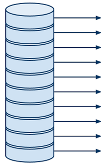
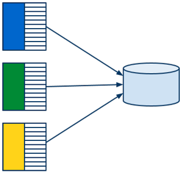

title: Agenda
content_class: smaller

- Other GAE Topics
    - Modules
	- MapReduce & GAE MapReduce API
	- Google Cloud Endpoints
- Organizational
	- Discussion on HWs.
	- Concluding remarks

---

title: Other GAE Services
subtitle: What else can be done with GAE	
class: segue dark nobackground

---

title: Modules
content_class: smaller

- [doc](https://developers.google.com/appengine/docs/python/modules/)
- Decomposition of GAE App
- Separate source code, configuration (security, libraries, versioning, ...), and URL
    - One 'default' - handles web requests
- Multiple running instances -> **different scaling options**
- Stateful services (e.g., Memcache, Datastore, and Task Queues) are shared by all the modules in an application

---

title: Modules: Scaling
content_class: smaller

- **Manual**
    - long-running task with complex initialization, maintaining memory state
    - fixed number of instances
    - explicit URL: `http://instance.version.module.app_id.appspot.com`
- **Basic**
    - creates an instance based on requests
    - max instance limit
    - no finish deadline (long-running requests), idle timeout
    - explicit URL as previous
- **Automatic**
    - original GAE scaling
    - creates instances based on request rate, response latencies
        - min/max idle instances
        - min/max pending latency
        - max concurrent requests (max 80!)

---

title: Modules: Config
content_class: smaller

<pre class="prettyprint" data-lang="Yaml">
application: simple-sample
<b>module: backend</b>
version: uno
runtime: python27
instance_class: B8
<b>manual_scaling:
  instances: 5</b>
</pre>

<pre class="prettyprint" data-lang="Yaml">
application: simple-sample
<b>module: mobile-frontend</b>
...
<b>automatic_scaling:
  min_idle_instances: 2
  max_pending_latency: 1s</b>
</pre>

---

title: Modules: Communication
content_class: smaller

- Explicit requests
    - validation of requests ([AppIdentity](https://developers.google.com/appengine/docs/python/appidentity),
    [OAuth](https://developers.google.com/appengine/docs/python/oauth),
    [GAE admin status](https://developers.google.com/appengine/docs/python/config/appconfig#Python_app_yaml_Requiring_login_or_administrator_status))

<pre class="prettyprint" data-lang="Python">
import urllib2
<b>from google.appengine.api import modules</b>

<b>url = "http://%s/" % modules.get_hostname(module="my-backend")</b>
try:
  <b>result = urllib2.urlopen(url)</b>
  doSomethingWithResult(result)
except urllib2.URLError, e:
  handleError(e)
</pre>

---

title: Modules: Communication II
content_class: smaller

- [Push Queues](https://developers.google.com/appengine/docs/python/taskqueue/overview-push)

<pre class="prettyprint" data-lang="Python">
from google.appengine.api import taskqueue
# ...
    def post(self):
        payload = self.request.get('payload')

        # Add the task to the default queue.
        taskqueue.add(url='/path/to/my/handler/', params={'payload': payload},
                      target='my-version.my-module')
</pre>

---

title: Modules: Communication III
content_class: smaller

- [Pull Queues](https://developers.google.com/appengine/docs/python/taskqueue/overview-pull)

<pre class="prettyprint" data-lang="Python">
# one module
from google.appengine.api import taskqueue

q = taskqueue.Queue('pull-queue')
tasks = []
payload_str = 'hello world'
tasks.append(taskqueue.Task(payload=payload_str, method='PULL'))
q.add(tasks)

# another module
from google.appengine.api import taskqueue

q = taskqueue.Queue('pull-queue')
tasks = q.lease_tasks(3600, 100)
# Perform some work with the tasks here
q.delete_tasks(tasks)
</pre>

---

title: Modules: Routing
content_class: smaller

- `dispatch.yaml` ([doc](https://developers.google.com/appengine/docs/python/modules/routing))

<pre class="prettyprint" data-lang="Yaml">
dispatch:
  # Default module serves the typical web resources and all static resources.
  - url: "*/favicon.ico"
    module: default

  # Default module serves simple hostname request.
  - url: "simple-sample.appspot.com/"
    module: default

  # Send all mobile traffic to the mobile frontend.
  - url: "*/mobile/*"
    module: mobile-frontend

  # Send all work to the one static backend.
  - url: "*/work/*"
    module: static-backend
</pre>

---

title: MapReduce
content_class: smaller

- [wiki](http://en.wikipedia.org/wiki/MapReduce), [paper](http://research.google.com/archive/mapreduce.html)
- Computing model for processing of large data sets
- Distributed, parallel, scalable, ...
- Robust
	- Based on functional programming (restarts almost always possible)
- General framework for implementing parallel processing
- Goal: Process as much data as possible, as fast as possible
- Used in a lot of Google (and other) products
- Idea:
	- Select and read in parallel the data to be processed 
	- Group the data, that should be processed together
	- Process the groups of the data belonging together in parallel

---

title: MapReduce Overview
content_class: smaller

---

title: MR Phase 1: Read
content_class: smaller

- Reads data from storage and passes it to the next phase
- Can run in parallel
- Various forms of input data
	- GAE Datastore entities
	- Files on a file system
	- Entries from a zip archive
	- ...
- No user code 
	 

---

title: MR Phase 2: Map
content_class: smaller

- Filters and maps raw data input to a list of key-value pairs 
- Indicates which values should be processed together 
	- By assigning the same keys
- `Map(data) -> list(key, value)`
- User code
- Runs (in isolation) once per each piece of input data
	- Highly parallelizeable
- Can exploit data locality
	- Local data are passed to local mapper tasks
- Can be scaled
	- By increasing the number of parallel mapper tasks
- Usualy produces huge amounts of key-value pairs
	 

---

title: MR Phase 3: Shuffle
content_class: smaller

- Groups the values that should be processed together
	- Based on the same keys of the key-value pairs 
- Complicated to parallelize
	- Includes sorting	
	- Huge sets of key-value pairs from map phase
- `Shuffle(list(key, value)) -> list(key, list(value))`
- No user code

---

title: MR Phase 4: Reduce
content_class: smaller

- Produces final output by processing corresponding values
	- Values of the key-value pairs with the same key are processed together
	- The lists of corresponding values might be pretty long
- `Reduce(key, list(value)) -> list(value)`
- User code
	- Usually includes most of the computation
- Runs (in isolation) once per each group of data with the same key
	- Easily parallelizeable
	- Different (coarser) granularity than map phase
 - Can be scaled
	- By increasing the number of parallel reduce tasks

---

title: MR Phase 5: Write
content_class: smaller

- Aggregates and stores the outputs produced in the reduce phase
- Has to serialized to some extent
- Various output formats
	- GAE Datastore entities
	- Files on a file system
	- ...
- No user code

---

title: MapReduce Summary
content_class: smaller

---

title: MR Hello World &mdash; Word Count
content_class: smaller

<pre class="prettyprint" data-lang="Python">
#Map
def map(line):
  for w in clean(line).split():
    yield (w, "")

# Reduce
def reduce(key, values):
  yield (key, len(values))
</pre>

<pre class="prettyprint" data-lang="Python">
#Input
"Zed's dead, baby, Zed's dead!"

#Map
("zed's", ""), ("dead", ""), ("baby", ""), ("zed's", ""), ("dead", "")

#Shuffle
("zed's", ["", ""]), ("dead", ["", ""]), ("baby", [""])

#Reduce
("zed's", 2), ("dead", 2), ("baby", 1)
</pre>

---

title: MR Example &mdash; Distinguishing phrases
content_class: smaller

<pre class="prettyprint" data-lang="Python">
# Map
def map(text, filename):
  for phrase in phrases(text):
    yield (phrase, filename)

# Reduce
def reduce(phrase, filenames):
  #not very frequent phrase, ignore
  if len(filenames) < 10:
    return
  #count occurence of the phrase in each of the files
  for filename, count in count_occurences(filenames):
    #phrase occurs in 'filename' more often than anywhere else combined
    if count > len(values) / 2:
      yield (key, filename)
</pre>

---

title: MapReduce on GAE
content_class: smaller

- [doc](https://developers.google.com/appengine/docs/python/dataprocessing/overview), 
[sources](https://code.google.com/p/appengine-mapreduce/),
[demo app](http://nswi152-mapreducedemo.appspot.com/),
[demo app sources](https://code.google.com/p/appengine-mapreduce/wiki/MapReduceDemoApp),
[Google IO 2011](https://www.youtube.com/watch?v=EIxelKcyCC0&list=PLD480D69728D72515),
[Google IO 2012](https://www.youtube.com/watch?v=lqQ6VFd3Tnw)
- Problems of running the general MapReduce on GAE
	- Performance isolation
		- A lot of MRs will be running at the same time
		- One user's MR shouldn't influence performance of other users' MRs
		- Originally &mdash; only a few MRs running concurrently
	- Process rate limiting
		- App must not to spend resources to quickly
		- Quota management is critical for some apps
		- Originally &mdash; as fast as possible, as much data as possible
	- Security 
		- Originally &mdash; only 'trusted' MRs

---

title: GAE MapReduce Features
content_class: smaller

- Processing rate limiting
- Automatic sharding
- Predefined standard data input readers/writers
	- Datastore entities, [Cloud Storage](https://developers.google.com/appengine/docs/java/googlecloudstorageclient/), [Log store](https://developers.google.com/appengine/docs/java/logs/),
	 blobstore plain/zip files
- Pipeline API
	- Wires all MR phases together
	- Generic API for asynchronous data processing (goes well with custom modules)
	- [sources](https://code.google.com/p/appengine-pipeline/), [Google IO 2011](https://www.youtube.com/watch?v=Rsfy_TYA2ZY),
	[Google IO 2012](https://www.youtube.com/watch?v=lqQ6VFd3Tnw)
- Status and management pages
- Open source &mdash; get involved!

---

title: GAE MapReduce Pipeline Overview
content_class: smaller 

---

title: GAE MR API &mdash; Pipeline Definition
content_class: smaller

<pre class="prettyprint" data-lang="Python">
from mapreduce import base_handler
from mapreduce import mapreduce_pipeline

class WordCountPipeline(<b>base_handler.PipelineBase</b>):
  def run(self, filekey, blobkey):
    logging.debug("filename is %s" % filekey)
    output = <b>yield mapreduce_pipeline.MapreducePipeline</b>(
        "word_count",
        <b>"main.word_count_map"</b>,			#user code
        <b>"main.word_count_reduce"</b>,		#user code
        <b>"mapreduce.input_readers.BlobstoreZipInputReader"</b>,
        <b>"mapreduce.output_writers.FileOutputWriter"</b>,
        mapper_params={
            "input_reader": {				# input reader params
                "blob_key": blobkey,
            },
        },
        reducer_params={
            "output_writer": {				# output writer params
                "mime_type": "text/plain",
                "output_sharding": "input",
                "filesystem": "blobstore",
            },
        },
        shards=16)
    <b>yield StoreOutput</b>("WordCount", filekey, output)
</pre>

---

title: GAE MR API &mdash; Start & Status
content_class: smaller

<pre class="prettyprint" data-lang="Python">
from mapreduce import mapreduce_pipeline

class StartAndStatusHandler(webapp2.RequestHandler):
  def post(self):
    filekey = self.request.get("filekey")
    blob_key = self.request.get("blobkey")

    if self.request.get("word_count"):
      <b>pipeline = WordCountPipeline(filekey, blob_key)</b>
      <b>pipeline.with_params(target="my-version.my-module")</b>
      <b>pipeline.start()</b>
    
      self.redirect(<b>pipeline.base_path + "/status?root=" + pipeline.pipeline_id</b>)

class WaitHandler(webapp2.RequestHandler):
  def get(self):
    pipeline_id = self.request.get('pipeline')
    <b>pipeline = mapreduce_pipeline.MapreducePipeline.from_id(pipeline_id)</b>
    if <b>pipeline.has_finalized</b>:
      # MapreducePipeline has completed
    else:
      # MapreducePipeline is still running
</pre>

---

title: GAE MR API &mdash; App Configuration
content_class: smaller

`app.yaml`

<pre class="prettyprint" data-lang="yaml">
...

includes:
- mapreduce/include.yaml

...
</pre>

- Declarative definition of MR pipelines in `mapreduce.yaml` ([doc](https://code.google.com/p/appengine-mapreduce/wiki/UserGuidePython))
	- Work in progress
	- Docs for mapper part only

---

title: GAE MapReduce API Demo
content_class: smaller

<iframe data-src="http://nswi152-mapreducedemo.appspot.com/"></iframe>

---

title: Google Cloud Endpoints: API definition
content_class: smaller

- [doc](https://developers.google.com/appengine/docs/python/endpoints/)

<pre class="prettyprint" data-lang="Python">
@endpoints.api(name='yourApi',version='v1',
               description='Tic Tac Toe API')
class TicTacToeApi(remote.Service):
 ...

class YourResponseMessageClass(messages.Message):
    message = messages.StringField(1)

class YourRequestMessageClass(messages.Message):
    message = messages.StringField(1)

@endpoints.method(YourRequestMessageClass,
                  YourResponseMessageClass,
                  name='foo.bar', ...)
def bar(self, request):
...

</pre>

---

title: Google Cloud Endpoints: Server side
content_class: smaller

- `services.py`

<pre class="prettyprint" data-lang="Python">
import endpoints
import TicTacToeApi

application = endpoints.api_server([TicTacToeApi])
</pre>

- `app.yaml`

<pre class="prettyprint" data-lang="Yaml">
...
handlers:
# Endpoints handler
- url: /_ah/spi/.*
  script: services.application
...
libraries:
- name: endpoints
  version: 1.0
</pre>

- Explore at `/_ah/api/explorer`

---

title: Further Reading
content_class: smaller

- [Google I/O 2012 - Optimizing Your Google App Engine App](https://www.youtube.com/watch?v=zQ5_47zy4bY)
- [Google I/O 2013 - Building developers.google.com on App Engine](https://developers.google.com/events/io/sessions/333307296)
- [Google I/O 2012](https://developers.google.com/events/io/2012/sessions#cloud-platform)
- Big Query ([GCPLive 2014](https://www.youtube.com/watch?v=GrD7ymUPt3M), [Google I/O 2012 talk](https://www.youtube.com/watch?v=QI8623HlYd4)), ([doc](https://developers.google.com/bigquery/)),
([tutorial](https://developers.google.com/bigquery/articles/datastoretobigquery))
- Google Compute Engine ([doc](https://cloud.google.com/products/compute-engine))
- Google Cloud SQL ([doc](https://developers.google.com/cloud-sql/))

---

title: Organizational
class: segue dark nobackground

---

title: Homeworks
content_class: smaller

- Homework submissions accepted till 8.6.2016

#Evaluation

- Should use at least 2 of the advanced datastore-based features
	- Transactions, consistency, sharding, cursors, special types of queries, asynchronous operations
- Should use at least 2 service APIs
	- Memcache, Task Queues, Blobstore, Channels, Endpoints, BigQuery, ...
- Send a description via email for confirmation
- Work in groups preferred
- Don't worry

#Discussion

- What problem/domain did you choose?
- What was interesting?
- What services did you use?

---

title: Conclusion & Discussion
content_class: smaller

This course was a mere "door opening", rather than a fully-fledged lecture.  
Please help us make it better!

- Did you find the course useful?
- What was (not) interesting?
- What would (wouldn't) you like to know more about?
- What did you learn during lectures/homeworks?
- Would you consider using GAE in the future?

For offline discussion: <vinarek@d3s.mff.cuni.cz>

