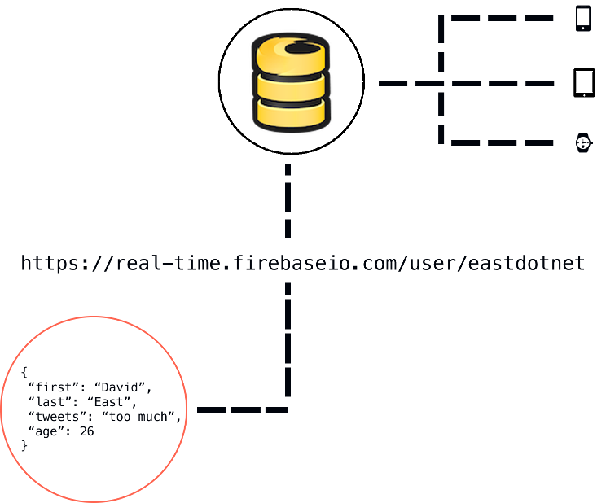

<!--title: Firebase-->
<!-- content_class: smaller -->

<!--  -->
<!---->

---

title: Firebase overview I
content_class: smaller

- Backend as a service (BaaS)

- Products to develop & test your app
    - **Real-time database** (backend for your app)
    - Authentication
    - Cloud Storage
    - Hosting
    - ...    
- Products to "grow & engage your audience"
    - Google Analytics
    - Dynamic Links
    - Remote Config
    - AdWords
    - ...
- Tight integration with Google Cloud Platform
    
---

title: Firebase overview II
content_class: smaller

- Apps can run on client-side code only 

- Platforms:
    - iOS
    - Android
    - Web
    - Games
        - C++ on iOS and Android
        - Unity game engine

---

title: Firebase Database I
content_class: smaller

- NoSQL data-store
- Returns JSON from a RESTful API

---

title: Firebase Database II
content_class: smaller

- Whenever **data is updated in Firebase**, it sends the update down to every **listening client**

---

title: Application
content_class: smaller

- Based on Firebase Web Codelab
    - [Firebase Web Codelab](https://codelabs.developers.google.com/codelabs/firebase-web)
    - [Cloud Functions for Firebase](https://codelabs.developers.google.com/codelabs/firebase-cloud-functions)