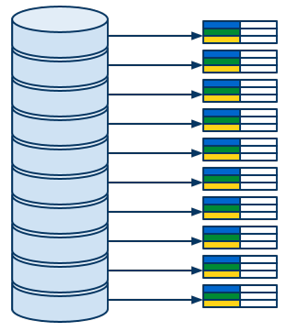
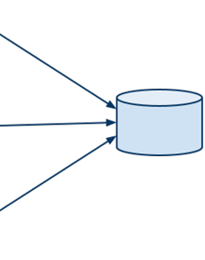

title: Agenda
content_class: smaller

- Other GAE Services
	- MapReduce & GAE MapReduce API
	- Google Big Query service
- Miscellaneous
	- Discussion on HWs.
	- Concluding remarks

---

title: Other GAE Services
subtitle: What else can be done with GAE	
class: segue dark nobackground

---

title: MapReduce 
content_class: smaller

- [wiki](http://en.wikipedia.org/wiki/MapReduce), [paper](http://research.google.com/archive/mapreduce.html)
- Computing model for processing of large data sets
- Distributed, parallel, scalable, ...
- Robust
	- Based on functional programming (restarts almost always possible)
- General framework for implementing parallel processing
- Goal: Process as much data as possible, as fast as possible
- Used in a lot of Google (and other) products
- Idea:
	- Select and read in parallel the data to be processed 
	- Group the data, that should be processed together
	- Process the groups of the data belonging together in parallel

---

title: MapReduce Overview
content_class: smaller

---

title: MR Phase 1: Read
content_class: smaller

- Reads data from storage and passes it to the next phase
- Can run in parallel
- Various forms of input data
	- GAE Datastore entities
	- Files on a file system
	- Entries from a zip archive
	- ...
- No user code 
	 

---

title: MR Phase 2: Map
content_class: smaller

- Filters and maps raw data input to a list of key-value pairs 
- Indicates which values should be processed together 
	- By assigning the same keys
- `Map(data) -> list(key, value)`
- User code
- Runs (in isolation) once per each piece of input data
	- Highly parallelizeable
- Can exploit data locality
	- Local data are passed to local mapper tasks
- Can be scaled
	- By increasing the number of parallel mapper tasks
- Usualy produces huge amounts of key-value pairs
	 

---

title: MR Phase 3: Shuffle
content_class: smaller

- Groups the values that should be processed together
	- Based on the same keys of the key-value pairs 
- Complicated to parallelize
	- Includes sorting	
	- Huge sets of key-value pairs from map phase
- `Shuffle(list(key, value)) -> list(key, list(value))`
- No user code

---

title: MR Phase 4: Reduce
content_class: smaller

- Produces final output by processing corresponding values
	- Values of the key-value pairs with the same key are processed together
	- The lists of corresponding values might be pretty long
- `Reduce(key, list(value)) -> list(value)`
- User code
	- Usually includes most of the computation
- Runs (in isolation) once per each group of data with the same key
	- Easily parallelizeable
	- Different (coarser) granularity than map phase
 - Can be scaled
	- By increasing the number of parallel reduce tasks

---

title: MR Phase 5: Write
content_class: smaller

- Aggregates and stores the outputs produced in the reduce phase
- Has to serialized to some extent
- Various output formats
	- GAE Datastore entities
	- Files on a file system
	- ...
- No user code

---

title: MapReduce Summary
content_class: smaller

---

title: MR Hello World &mdash; Word Count
content_class: smaller

<pre class="prettyprint" data-lang="Python">
#Map
def map(line):
  for w in clean(line).split():
    yield (w, "")

# Reduce
def reduce(key, values):
  yield (key, len(values))
</pre>

<pre class="prettyprint" data-lang="Python">
#Input
"Zed's dead, baby, Zed's dead!"

#Map
("zed's", ""), ("dead", ""), ("baby", ""), ("zed's", ""), ("dead", "")

#Shuffle
("zed's", ["", ""]), ("dead", ["", ""]), ("baby", [""])

#Reduce
("zed's", 2), ("dead", 2), ("baby", 1)
</pre>

---

title: MR Example &mdash; Distinguishing phrases
content_class: smaller

<pre class="prettyprint" data-lang="Python">
# Map
def map(text, filename):
  for phrase in phrases(text):
    yield (phrase, filename)

# Reduce
def reduce(phrase, filenames):
  #not very frequent phrase, ignore
  if len(filenames) < 10:
    return
  #count occurence of the phrase in each of the files
  for filename, count in count_occurences(filenames):
    #phrase occurs in 'filename' more often than anywhere else combined
    if count > len(values) / 2:
      yield (key, filename)
</pre>

---

title: MapReduce on GAE
content_class: smaller

- [doc](https://developers.google.com/appengine/docs/python/dataprocessing/overview), 
[sources](https://code.google.com/p/appengine-mapreduce/),
[demo app](https://code.google.com/p/appengine-mapreduce/wiki/MapReduceDemoApp),
[Google IO 2011 talk](http://www.google.com/events/io/2011/sessions/app-engine-mapreduce.html)
- Problems of running the general MapReduce on GAE
	- Performance isolation
		- A lot of MRs will be running at the same time
		- One user's MR shouldn't influence performance of other users' MRs
		- Originally &mdash; only a few MRs running concurrently
	- Process rate limiting
		- App must not to spend resources to quickly
		- Quota management is critical for some apps
		- Originally &mdash; as fast as possible, as much data as possible
	- Security 
		- Originally &mdash; only 'trusted' MRs

---

title: GAE MapReduce Features
content_class: smaller

- Processing rate limiting
- Automatic sharding
- Predefined standard data input readers/writers
	- Datastore entities, blobstore plain/zip files
- Status and management pages
- Pipeline API
	- Wires all MR phases together
- Files API
	- Persistent/Intermediate storage for MR data

---

title: GAE MapReduce Examples
content_class: smaller

<pre class="prettyprint" data-lang="Python">
# Map
def map(text, filename):
  for phrase in phrases(text):
    yield (phrase, filename)

# Reduce
def reduce(phrase, filenames):
  #not very frequent phrase, ignore
  if len(filenames) < 10:
    return
  #count occurence of the phrase in each of the files
  for filename, count in count_occurences(filenames):
    #phrase occurs in 'filename' more often than anywhere else combined
    if count > len(values) / 2:
      yield (key, filename)
</pre>

---

title: Further Reading
content_class: smaller

- [Google IO 2011](http://www.google.com/events/io/2011/sessions.html)
