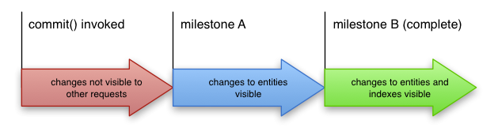

title: Datastore
subtitle: In-depth look	
class: segue dark nobackground

---

title: Datastore Overview
content_class: smaller

- [Doc](https://developers.google.com/appengine/docs/python/datastore/overview)
- Distributed storage based on [Bigtable](http://static.googleusercontent.com/external_content/untrusted_dlcp/research.google.com/cs//archive/bigtable-osdi06.pdf)
	- Highly scalable
	- In fact 6 Bigtables (1 for all the data, 4 for indexes, ..., [doc](https://developers.google.com/appengine/articles/storage_breakdown?hl=en#anc-tables))
- Replication across multiple data centers using the [Paxos algorithm](http://static.googleusercontent.com/external_content/untrusted_dlcp/research.google.com/en/us/archive/paxos_made_live.pdf)
	- High availability (five 9s)
	- Eventual consistency ([wiki](http://en.wikipedia.org/wiki/Eventual_consistency))
- Entity = unit of data storage
	- kind, id, value, ...
- Entities located either directly via keys or in queries via pre-built indexes 
	- All queries are served via the indexes => limited but scalable queries 
	- Direct access via key can be simple/[batch](https://developers.google.com/appengine/docs/python/datastore/entities#Batch_Operations)/[async]()

---

title: Entities
content_class: smaller

- [Doc](https://developers.google.com/appengine/docs/python/datastore/entities)
- Identifier
	- User-supplied key name 
	- Automatically assigned numeric ID
- Named properties of various [types](https://developers.google.com/appengine/docs/python/datastore/entities#Properties_and_Value_Types)
	- Each can have one or more values 
- Kind: categorizes the entity for the purpose of queries
	- In python the Model class
- Model: prescription of an entity ([doc](https://developers.google.com/appengine/docs/python/datastore/datamodeling))
	- Individual entities of the same kind can have different sets of properties ([doc](https://developers.google.com/appengine/docs/python/datastore/datamodeling#The_Expando_Class))
	- Models can be hierarchic, allowing queries over a kind and its sub-kinds ([doc](https://developers.google.com/appengine/docs/python/datastore/datamodeling#The_PolyModel_Class))

---

title: Entities II
content_class: smaller

- Key: enables direct access
	- Unique for each entity
	- Includes: entity's kind, identifier, ancestor path (later)
	- Permanent == cannot be changed
- Parent property
	- Entities form hierarchically structured space (similar to a file system)
	- Root entities: no parent
	- Permanent == cannot be changed
- Ancestor path
	- Full path from the root entity to a given entity
	- Kind-identifier pairs
- Key = Ancestor path + own kind-identifier pair
	- `Person:GreatGrandpa / Person:Grandpa / Person:Dad / Person:Me`

---

title: Entities III
content_class: smaller

- Entity group ([doc](https://developers.google.com/appengine/docs/python/datastore/entities#Transactions_and_Entity_Groups))
	- An entity and its descendants (transitive children)
	- Unit of transactionality (later)
		- Transactions can only read/write entities in a single group
	- Unit of consistency (later)
		- Will always Get an entity once Put
	- Limitations
		- Limited throughput 
			- Max 1 write/s, in reality up to 5-10 writes/s
		- Write/s != Entity/s
			- Batch puts count as 1 write ([doc](https://developers.google.com/appengine/docs/python/datastore/entities#Batch_Operations))
	- Arbitrary size
		- 10's of Milions of entities
		- Better to make small entity groups to avoid write contention ([tutorial](https://developers.google.com/appengine/articles/scaling/contention?hl=en))
	- Root entities are in separate entity groups

---

title: Queries
content_class: smaller

- [Doc](https://developers.google.com/appengine/docs/python/datastore/queries)
- Each query includes:
	- [Entity kind](https://developers.google.com/appengine/docs/python/datastore/entities#Kinds_and_Identifiers)
	- Zero or more [filters](https://developers.google.com/appengine/docs/python/datastore/queries#Filters) (based on property values, keys, ancestors)
		- Property queries may take one of the forms: =, <, <=, ..., !=, IN
	- Zero or more [sort orders](https://developers.google.com/appengine/docs/python/datastore/queries#Sort_Orders)

<pre class="prettyprint" data-lang="Python">
# Query interface constructs a query using instance methods
q = Person.all()
q.filter("last_name =", "Smith")
q.filter("height <=", max_height)
q.ancestor(ancestor_key)
q.order("-height")
</pre>

---

title: Queries II
content_class: smaller

- Queries are based solely on the indexes
  ([doc](https://developers.google.com/appengine/docs/python/datastore/queries#Restrictions_on_Queries)) (details later)
	- First row of the corresponding index matching the filter is found (fast)
	- All the consecutive rows matching the filter are returned (up to the limit)
- Benefits
	- Scalable with the size of the result set
- [Restrictions](https://developers.google.com/appengine/docs/python/datastore/queries#Restrictions_on_Queries)
	- A lot of indexes required
	- Entities lacking a property named in the query are ignored.
	- Filtering on unindexed properties returns no results.
	- Inequality filters are limited to at most one property, *but can include equality on another property:*

<pre class="prettyprint" data-lang="GQL">
SELECT * FROM Person WHERE last_name = :target_last_name
                       AND city = :target_city
                       AND birth_year >= :min_birth_year
                       AND birth_year <= :max_birth_year
</pre>

---

title: Queries III
content_class: smaller

- [Restrictions](https://developers.google.com/appengine/docs/python/datastore/queries#Restrictions_on_Queries) cont.
	- Ordering of query results is undefined when no sort order is specified.
	- Sort orders are ignored on properties with equality filters.
	- Properties used in inequality filters must be sorted first.
	- Properties with multiple values can behave in surprising ways.
		- Depends on index search
		- At least one of the values satisfies *all* of the *inequality* filters
		- All of the *equality* filters are satisfied by *at least one* (each by potentially different) value
	- Queries inside transactions must include ancestor filters.
		- Entity group == unit of transactionality

---

title: Queries IV
content_class: smaller

- Retrieving data ([doc](https://developers.google.com/appengine/docs/python/datastore/queryclass#Query_run))
	- Limit on the number of results returned (to conserve resources)
	- Offset of the first returned entity
		- Still retrieved internally, better to use a [cursor](https://developers.google.com/appengine/docs/python/datastore/queries#Query_Cursors)
	- Internally retrieved in batches (batch size can be set)
	- Queries can have time-outs (maximum 60sec)
		- To ensure fast response
	
<pre class="prettyprint" data-lang="Python">
q = Person.all()
...

for p in q.run(offset=5, limit=5, batch_size=50, dealine=10):
  print "%s %s, %d inches tall" % (p.first_name, p.last_name, p.height)
</pre>

---

title: Special Types of Queries
content_class: smaller

- Projection Query ([doc](https://developers.google.com/appengine/docs/python/datastore/projectionqueries))
	- Retrieves only selected (indexed) properties
	- Runs solely on top of indexes (runs faster and costs less than normal query)
	- Entities returned by a projection query cannot be stored back
	- For multivalued properties generates all combination of found values (as stored in the index)
		- Including more than one multi-valued property in a projection requires an [exploding index](https://developers.google.com/appengine/docs/python/datastore/queries#Big_Entities_and_Exploding_Indexes)
- Keys-Only Query ([doc](https://developers.google.com/appengine/docs/python/datastore/queries#Keys_Only_Queries))
	- Returns only keys 
	- Usually combined with a batch read of the relevant entities
	- Same advantages/limitations as projection query 

---

title: Special Types of Queries II
content_class: smaller

- Kindles Query ([doc](https://developers.google.com/appengine/docs/python/datastore/queries#Kindless_Queries))
	- Cannot include filters or sort orders on property values
	- Can have filter on keys, `db.Query().filter('__key__ >', last_seen_key)`
	- Can have ancestor filter
- Ancestor query
	- Every query with an ancestor filter
	- `db.query_descendants()` to return a query for all descendants of a given entity

---

title: Cursors
content_class: smaller

- [Doc](https://developers.google.com/appengine/docs/python/datastore/queries?hl=en#Query_Cursors)
- For fetching additional results of a query in a subsequent request without offset overhead
- String-encoded position in the index corresponding to the query
	- base64-encoded string, may expose the key (app ID, kind, key name or ID, and all ancestor keys) and properties used in the query (including filters and sort orders)
	- Cursor can be passed as HTTP GET/POST parameter or stored in datastore/memcache
- Can be used only by the same application to resume the same query
- A cursor determines an absolute position within an index
	- NOT a relative position in the result list
	- Data updates can have impact on the next results returned
- Both *start* and *end* cursors
	- You are not guaranteed that the size of the results will be the same as when you generated the cursors

---

title: Cursors II
content_class: smaller

<pre class="prettyprint" data-lang="Python">
people = Person.all()

person_cursor = memcache.get('person_cursor')
if person_cursor:
  people<b>.with_cursor(start_cursor=person_cursor)</b>

for person in people:
  # Do something

person_cursor = people<b>.cursor()</b>
memcache.set('person_cursor', person_cursor)
</pre>

---

title: Indexes
content_class: smaller

- [Doc](https://developers.google.com/appengine/docs/python/datastore/indexes)
- **Index** is a table containing entity keys of a given kind in a sequence specified by the index's properties
	- A column for every property in the index
	- A row for every entity in the Datastore that is a potential result for queries based on the index
	- Rows are sorted first by ancestor and then by property values, in the order specified in the index definition
- `index.yaml` configuration file ([doc](https://developers.google.com/appengine/docs/python/config/indexconfig))
	- Automatically updated by the dev. server when a new query is executed
- An entity is included in the index only if it has a value set for every property used in the index
	- Can have value `None`
- A *perfect index* ensures that all results for every possible execution of the query appear in consecutive rows of the index table

---

title: Indexes II
content_class: smaller

- A *perfect index* has (in the order of importance):
	- Properties used in equality filters
	- Property used in an inequality filter (of which there can be no more than one)
	- Properties used in sort orders
- During execution of a query, the Datastore:
	- Identifies the perfect index corresponding to the query
	- Scans from the beginning of the index to the first entity that meets all of the query's filter conditions
	- Continues scanning the index, returning each entity in turn, until it
		- encounters an entity that does not meet the filter conditions, or
		- reaches the end of the index, or
		- has collected the maximum number of results requested by the query.

---

title: Indexes III
content_class: smaller

- Indexes have [limits](https://developers.google.com/appengine/docs/python/datastore/overview#Quotas_and_Limits)
	- Maximum number of index entries for an entity (20000)
	- Maximum number of bytes in composite indexes for an entity (2 megabytes)
- [Exploding indexes](https://developers.google.com/appengine/docs/python/datastore/indexes#Index_Limits)
	- For entities with multiple properties where each has multiple values the index must include an entry *for every possible combination* of property values
	- The number of entries "explodes" combinatorially
	- For example the entity  
	<pre class="prettyprint" data-lang="Python">
		class Widget(db.Expando):
		  pass		
		e2 = Widget()
		e2.x = [1, 2, 3, 4]
		e2.y = ['red', 'green', 'blue']
		e2.date = datetime.datetime.now()
		e2.put()	
	</pre>	requires 12 index entries for the composite index `Widget(x, y, date)`

---

title: Indexes IV
content_class: smaller

- The number/type of indexes influences the cost of a single write ([doc](https://developers.google.com/appengine/docs/python/datastore/indexes#Index_Limits), [tutorial](https://developers.google.com/appengine/docs/python/datastore/entities#Understanding_Write_Costs))
	- 1 + the number of entries in the indexes the entity would appear in 
	- By default 3 indexes
		- `EntitiesByKind`
		- `EntitiesByProperty`
		- `EntitiesByPropertyDesc`
		- i.e., 1 for the kind index and then 2 for each property value. 
	- Exploding indexes slow down entity writes dramatically (and may cause the entity to exceed the index limit)
- Exploding indexes can be manually avoided ([tutorial](https://developers.google.com/appengine/articles/indexselection))

---

title: Data Consistency
content_class: smaller

- Two consistency levels ([doc](https://developers.google.com/appengine/docs/python/datastore/queries#Data_Consistency))
	- [Strong consistency](http://en.wikipedia.org/wiki/Strong_consistency): queries guarantee the freshest results, but may take longer to complete
	- [Eventual consistency](http://en.wikipedia.org/wiki/Eventual_consistency): queries generally run faster, but may occasionally return stale results
- Eventually consistent queries:
	- May use stale indexes
	- May sometimes return entities that no longer match the original query criteria
- Ancestor queries are strongly consistent by default
	- Can be made eventually consistent Datastore read policy
	- `Employee.all()...run(read_policy=db.EVENTUAL_CONSISTENCY)`
- Non-ancestor queries are always eventually consistent
- *Facebook exercise:* users own posts are strongly consistent (for the purpose of administration), posts of other users are eventually consistent
- Further reading: [Structuring Data for Strong Consistency](https://developers.google.com/appengine/docs/python/datastore/structuring_for_strong_consistency)

---

title: Transactions
content_class: smaller

- [Doc](https://developers.google.com/appengine/docs/python/datastore/transactions)
- [Transaction Isolation](https://developers.google.com/appengine/articles/transaction_isolation)
- An operation or set of operations that is atomic
	- Either all or none operations are applied
- Defined on *a single entity group*
	- Recall that each root entity belongs to a separate entity group
	- Ancestor queries are always run in a transaction
- Consistency Inside Transactions: Serializable 
	- In a transaction, all reads reflect the current, consistent state of the Datastore at the time the transaction started.
	- [Snapshot isolation](http://en.wikipedia.org/wiki/Snapshot_isolation)
- Consistency Outside Transactions: Read Committed
	- Entities retrieved from the datastore by queries or gets will only see committed data.

---

title: Transactions II
content_class: smaller

- Consistency Outside Transactions cont.
	- Queries can include entities, whose current data fail to meet the query constraints. 
	- Queries and gets inside a Datastore transaction **do not see the results of previous writes** inside that transaction.
		- If an entity is modified or deleted within a transaction, a query or get returns the original version of the entity as of the beginning of the transaction, or nothing if the entity did not exist then

---

title: Transactions &mdash; The Commit Process
content_class: smaller

- [Google IO 2012 Video](http://www.google.com/events/io/2011/sessions/more-9s-please-under-the-covers-of-the-high-replication-datastore.html)
- [Transaction Isolation in App Engine](https://developers.google.com/appengine/articles/transaction_isolation)
- [Life of a Datastore Write](https://developers.google.com/appengine/articles/life_of_write)
- Synchronous commit (to a majority of replicas), asynchronous (2-phase) apply
	- In the apply phase, the entity's data and the index rows are written to disk in parallel
- Visibility to other transactions
	- First apply milestone &mdash; entity changes visible
	- Second apply milestone &mdash; index changes visible

---

title: Transactions &mdash; The Return Value
content_class: smaller

- [Life of a Datastore Write](https://developers.google.com/appengine/articles/life_of_write)
- If the entity data fails to update in the commit phase, no changes are made. 
- If the commit phase has succeeded but the apply phase failed
	- The next time you execute a read or write or start a transaction on this entity group, the datastore will first roll forward and fully apply this committed but unapplied write
	- The datastore continuously sweeps for partially applied jobs and rolls forward writes to indexes and entities that have not yet received the changes to the entity
- If your app receives an exception when submitting a transaction, it does not always mean that the transaction failed.
	- You can receive the following exceptions in cases where transactions have been committed and eventually will be applied successfully
		 - `Timeout`, `TransactionFailedError`, or `InternalError`

---

title: Transactions &mdash; Concurrency
content_class: smaller

- When two or more transactions simultaneously attempt to modify entities in one or more common entity groups, only the first transaction to commit its changes can succeed; all the others will fail on commit.
	- [Optimistic concurrency control](http://en.wikipedia.org/wiki/Optimistic_concurrency_control)
	- **Tip:** *A transaction should happen as quickly as possible to reduce the likelihood that the entities used by the transaction will change, causing the transaction to fail.*
- In HRD, the transaction is typically completely applied within a few hundred milliseconds after the commit returns.

---

title: Transactions API
content_class: smaller

<pre class="prettyprint" data-lang="Python">
from google.appengine.ext import db

class Accumulator(db.Model):
    counter = db.IntegerProperty(default=0)

<b>@db.transactional
def increment_counter(key, amount)</b>:
    obj = db.get(key)
    obj.counter += amount
    obj.put()

q = db.GqlQuery("SELECT * FROM Accumulator")
acc = q.get()

<b>increment_counter(acc.key(), 5)</b>
</pre>

<pre class="prettyprint" data-lang="Python">
...
<b>def increment_counter(key, amount):</b>
...

<b>db.run_in_transaction(increment_counter, acc.key(), 5)</b>
</pre>

---

title: Datastore Tips & Tricks
subtitle: How to do things effectively
class: segue dark nobackground

---

title: Sharding Counters
content_class: smaller

- [Tutorial](https://developers.google.com/appengine/articles/sharding_counters), [Google IO 2008 talk](https://sites.google.com/site/io/building-scalable-web-applications-with-google-app-engine)
- Main motivation:
	- Writes to a single entity (group) are expensive and limited to 1-5/s
		- Counters can be updated more than 5/s
	- Distributed reads are very effective
- Solution &mdash; break the counter into N different counters
	- On increment choose a random shard and increment it
	- When reading the counter value, read all shards and sum up their values
- You can use [memcache](https://developers.google.com/appengine/docs/python/memcache/) to improve the performance

---

title: Sharding Counters II
content_class: smaller

<pre class="prettyprint" data-lang="Python">
import random
from google.appengine.ext import ndb

NUM_SHARDS = 20

class <b>SimpleCounterShard</b>(ndb.Model):
    <b>count = ndb.IntegerProperty</b>(default=0)

def get_count():
    total = 0
    <b>for counter in SimpleCounterShard.query():</b>
        <b>total += counter.count</b>
    <b>return total</b>

<b>@ndb.transactional</b>
def increment():
    <b>shard_string_index =</b> str(<b>random.randint</b>(0, NUM_SHARDS - 1))
    <b>counter = SimpleCounterShard.get_by_id(shard_string_index)</b>
    if counter is None:
        counter = SimpleCounterShard(id=shard_string_index)
    <b>counter.count += 1</b>
    <b>counter.put()</b>
</pre>

---

title: Further Reading on Datastore
content_class: smaller

- Tutorials
	- [Mastering the datastore](https://developers.google.com/appengine/articles/datastore/overview)
	- [Handling datastore errors](https://developers.google.com/appengine/articles/handling_datastore_errors)
	- [Modeling Entity Relationships](https://developers.google.com/appengine/articles/modeling)
	- [Accessing the Datastore Remotely With remote_api](https://developers.google.com/appengine/articles/remote_api)	
	- [Best practices for writing scalable applications](https://developers.google.com/appengine/articles/scaling/overview)
- Datastore internals
	- [Life of a Datastore Write](https://developers.google.com/appengine/articles/life_of_write)
	- [Transaction Isolation in App Engine](https://developers.google.com/appengine/articles/transaction_isolation)
	- [How Entities and Indexes are Stored](https://developers.google.com/appengine/articles/storage_breakdown)
	- [Life in App Engine Production](http://www.google.com/events/io/2011/sessions/life-in-app-engine-production.html)
	- [More 9s Please: Under The Covers of the High Replication Datastore](http://www.google.com/events/io/2011/sessions/more-9s-please-under-the-covers-of-the-high-replication-datastore.html)
	- [Android + App Engine: A Developer's Dream Combination](http://www.google.com/events/io/2011/sessions/android-app-engine-a-developer-s-dream-combination.html)

---

title: Other GAE Services
subtitle: What comes handy
class: segue dark nobackground

---

title: Memcache
content_class: smaller

- [Doc](https://developers.google.com/appengine/docs/python/memcache/)
- A high-performance, distributed memory object caching system
- Useful for storing
	- Frequently fetched entities
	- Transient and frequently updated data (non-critical counters)
	- Rendered HTML for popular requests
- Typically used in the following pattern

<pre class="prettyprint" data-lang="Python">
def get_data():
    data = <b>memcache.get</b>('key')
    <b>if data is not None</b>:
        return data
    <b>else</b>:
        data = self.<b>query_for_data()</b> !L!J
        <b>memcache.add</b>('key', data, 60)
        return data
</pre>

- Further reading &mdash; [Effective memcache](https://developers.google.com/appengine/articles/scaling/memcache)

---

title: Task Queues
content_class: smaller

- [Doc](https://developers.google.com/appengine/docs/python/taskqueue/)
- Helps organizing the background work in discrete *tasks* and execute them in a designated worker *queue*
- [Push queues](https://developers.google.com/appengine/docs/python/taskqueue/overview-push)
	- Defers tasks to be executed by GAE on background
	- Ideal for long-running (longer than 60s) request reactions (up to 10 minutes)
		- Sending notification emails
	- Allows configuring processing rate
- [Pull queues](https://developers.google.com/appengine/docs/python/taskqueue/overview-pull)
	- Allows to execute (consume) tasks outside the GAE's default taks processing system
	- In a [backend](https://developers.google.com/appengine/docs/python/backends) (later)
	- Outside GAE ([Task Queue REST API](https://developers.google.com/appengine/docs/python/taskqueue/rest))

---

title: Push Task Queues
content_class: smaller

- [Doc](https://developers.google.com/appengine/docs/python/taskqueue/overview-push)
- Tasks are mapped to request handlers asynchronously invoked by GAE (queue)
	- Access to tasks URLs can be restricted to admins only ([doc](https://developers.google.com/appengine/docs/python/config/appconfig#Requiring_Login_or_Administrator_Status))
- `DeadlineExceededError` shortly before the 10min limit
	-  To save your work, log progress, or forward to a new task
- Order of execution
	- FIFO + optimization of global latency + countdown
- Failed tasks are automatically retried (gradual back-off)
	- Tasks should be [idempotent](http://en.wikipedia.org/wiki/idempotent)
- Queues configured in the `queue.yaml` file ([doc](https://developers.google.com/appengine/docs/python/config/queue))
	- Maximum execution rate
- Can be integrated with [CRON](https://developers.google.com/appengine/docs/python/config/cron)
- Can be deferred to a [backend](https://developers.google.com/appengine/docs/python/backends) (later) ([doc](https://developers.google.com/appengine/docs/python/taskqueue/overview-push#Push_Queues_and_Backends))
- [Limits](https://developers.google.com/appengine/docs/python/taskqueue/overview-push#Quotas_and_Limits_for_Push_Queues)
	- Task size (100KB), number of queues (10), queue execution rate (500 tasks/s)

---

title: The Deferred Library
content_class: smaller

- [Tutorial](https://developers.google.com/appengine/articles/deferred)
- Wrapper on top of Push Task Queues
	- Automatically packages the function call and its arguments and adds it to a task queue
	- No more setting up dedicated task handlers and serializing and deserializing parameters
- Built-in handler ([doc](https://developers.google.com/appengine/docs/python/config/appconfig#Builtin_Handlers))
- Works with any python 'callable', including functions, methods, class methods and callable objects

<pre class="prettyprint" data-lang="Python">
from google.appengine.ext import deferred

  def do_something_expensive(a, b, c=None):
      logging.info("Doing something expensive!")
      # Do your work here

  # Somewhere else
  deferred.defer(do_something_expensive, "Hello, world!", 42, c=True, 
                 _countdown=30, _queue="myqueue")
</pre>

---

title: The Deferred Library Tips
content_class: smaller

- Make tasks as small as possible (10KB limit)
	- The deferred library automatically stores the exceeding information into datastore (1MB limit)
- Don't pass entities to deferred.defer since it can cause races (better to pass keys)
- Failed tasks is always retried
	- If you don't wont GAE to retry, either return normally or raise `deferred.PermanentTaskFailure`
- You can't call nested functions, methods of nested classes, lambda functions, static methods, **methods in a request handler module**
- Use the deferred library if
	- You want a simple way of delegating workload to background
	- You have a lot of different background tasks
- Use the Task Queue API if
	- You need a control over how tasks are queued and executed
	- You want to manage throughput, minimize overhead, have direct control over tasks and better monitoring

---

title: Backends
content_class: smaller

- [Doc](https://developers.google.com/appengine/docs/python/backends/)
- Separate Python instances within your GAE app
	- No request deadlines
	- Have more resources than normal instances
	- Manually defined number and resources (do not scale with the app)
- Resident/Dynamic [types](https://developers.google.com/appengine/docs/python/config/backends#Types_of_Backends)
- Accessed via HTTP requests ([doc](https://developers.google.com/appengine/docs/python/backends/overview#Addressing_Backends))
- Pending task queue for incoming traffic
- Specific request handlers for start/processing ([doc](https://developers.google.com/appengine/docs/python/backends/overview#Backend_States))
	- Background (start) handler can start a program, that runs indefinitely, without accepting requests ([doc](https://developers.google.com/appengine/docs/python/backends/overview#background_threads))

<pre class="prettyprint" data-lang="Python">
from google.appengine.api import background_thread

def f(arg1, arg2, *kwargs):
  ...something useful...

tid = background_thread.start_new_background_thread(f, ["foo", "bar"])
</pre>

---

title: Backends &mdash; Types
content_class: smaller

<table>
  <tbody><tr>
    <th></th>
    <th>Resident</th>
    <th>Dynamic</th>
  </tr>
  <tr>
    <td>Startup/Shutdown</td>
    <td>Manual (Admin Console)</td>
    <td>Upon receipt of HTTP request / after idling a few minutes</td>
  </tr>
  <tr>
    <td>State</td>
    <td>Preserved</td>
    <td>Erased when shutdown after idle</td>
  </tr>
  <tr>
    <td>Processing type</td>
    <td>Continuous or driven by requests</td>
    <td>Driven by requests</td>
  </tr>
  <tr>
    <td>Cost</td>
    <td>More (run continuously)</td>
    <td>Less (shutdown after idle)</td>
  </tr>
  <tr>
    <td>Use</td>
    <td>
	Continuous processing or preserving state
        <ul>
        <li>Storing a game state in memory</li>
        <li>Caching a social graph or web index</li>
        <li>Running a web crawler</li>
        </ul>
    </td>
    <td>
	Request-based processing
    <ul>
      <li>Task queue requests requiring more power, time, or memory to complete.</li>
      <li>Report generation</li>
      <li>Large or complex user requests</li>
      <li>Ad-hoc queries or admin scripts</li>
    </ul>
    </td>
  </tr>
  <tr>
    <td>Load balancing</td>
    <td>Evenly balanced accross all instances</td>
    <td>Served by minimum number of instances first, new instances allocated as traffic increases</td>
  </tr>
</table>

---

title: Blobstore
content_class: smaller

- [Doc](https://developers.google.com/appengine/docs/python/blobstore/overview)
- Storage of large data objects (blobs)
- Blobs not created directly but sent to the Blostore service via HTTP Post request
	- Specific URL: `blobstore.create_upload_url('/upload')`
	- Redirected to a given handler with information about the uploaded blob
		 - `blobstore_handlers.BlobstoreUploadHandler` base class
	- Served by subclass of `blobstore_handlers.BlobstoreDownloadHandler`
		 - `send_blob`
- Each blob has a blob info record, stored in the datastore
	 - creation, content type, access URLs
- Blobs can't be modified after they're created
- Integrated with Images and MapReduce services
- Async API

---

title: Blobstore &mdash; API
content_class: smaller

<pre class="prettyprint" data-lang="Python">
from google.appengine.ext import blobstore

class MainHandler(webapp2.RequestHandler):
  def get(self):
    upload_url = <b>blobstore.create_upload_url</b>('/upload')
    self.response.out.write(self.render_form(upload_url))
</pre> 

<pre class="prettyprint" data-lang="Python">
from google.appengine.ext.webapp import blobstore_handlers
class UploadHandler(blobstore_handlers.BlobstoreUploadHandler):
  def post(self):
    upload_files = <b>self.get_uploads</b>('file')  # 'file' is file upload form field
    <b>blob_info = upload_files[0]</b>
    self.redirect('/serve/%s' % blob_info.key())
</pre> 

<pre class="prettyprint" data-lang="Python">
from google.appengine.ext import blobstore
from google.appengine.ext.webapp import blobstore_handlers
class ServeHandler(blobstore_handlers.BlobstoreDownloadHandler):
  def get(self, resource):
    resource = str(urllib.unquote(resource))
    blob_info = <b>blobstore.BlobInfo.get(resource)</b>
    <b>self.send_blob</b>(blob_info)
</pre> 

---

title: NDB
content_class: smaller

- [Doc](https://developers.google.com/appengine/docs/python/ndb/)
- Wrapper over the basic Datastore API and Memcache
- Additional features
	- The `StructuredProperty` allowing nested entity structure
	- Automatic caching giving fast (and inexpensive) reads via an in-context cache and Memcache
	- Asynchronous APIs allowing concurrency (and "synchronous" APIs if you don't need that)

---

title: Other Interesting Services
content_class: smaller

- [Mail](https://developers.google.com/appengine/docs/python/mail/)
	- Sending/receiving email on behalf of users with Google Accounts/admins
- [URL Fetch](https://developers.google.com/appengine/docs/python/urlfetch/)
	- Fetching resources and communicate with other hostsusing HTTP and HTTPS requests
- [Images](https://developers.google.com/appengine/docs/python/images/)
	- Manipulation of image data, integration with Blobstore
- [Channels](https://developers.google.com/appengine/docs/python/channel/)
	- Sending messages to client using JavaScript
- [MapReduce API](https://developers.google.com/appengine/docs/python/dataprocessing/overview)
	- Parallel processing and analysis of large data sets
- [BigQuery API](https://developers.google.com/bigquery/articles/datastoretobigquery)
	- Queries over very large data sets
- And a lot [more](https://developers.google.com/appengine/docs/python/apis)

---

title: Homework
content_class: smaller

- Should use at least 2 of the advanced datastore-based features
	- Transactions, consistency, sharding, cursors, special types of queries, asynchronous operations
- Should use at least 2 service APIs
	- Memcache, Task Queues, Blobstore, Channels, ...
- Send a description via email for confirmation
- Work in groups preferred
- Due in 2 weeks

